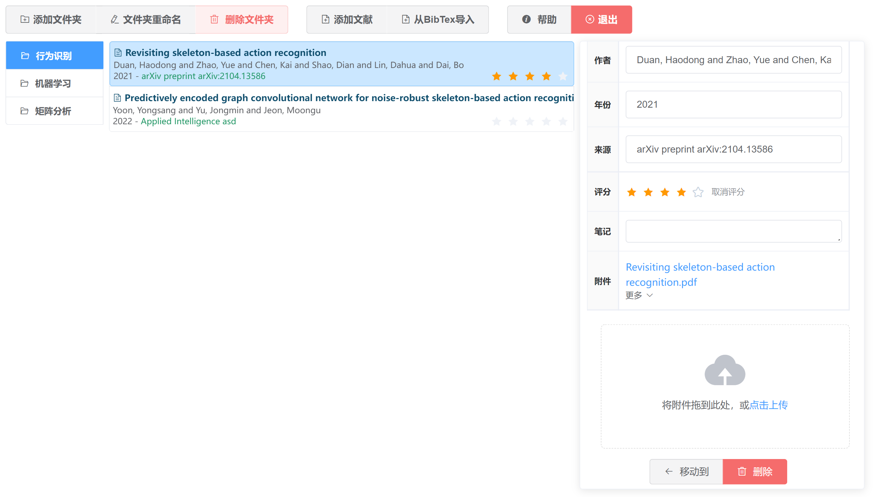
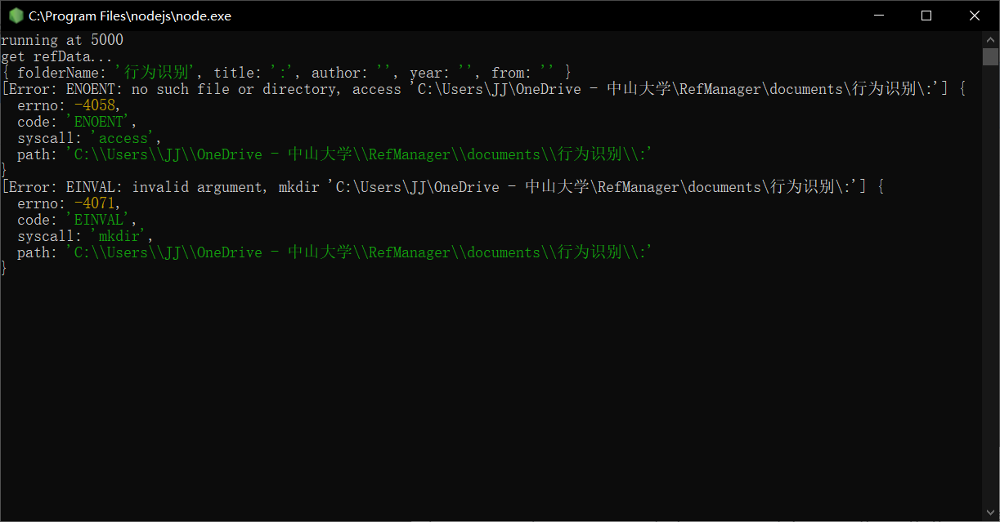
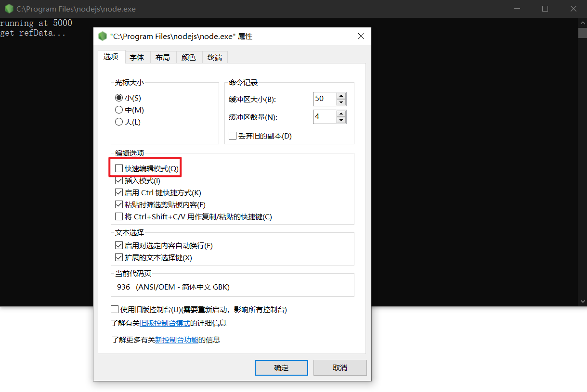
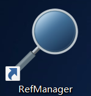

## RefManager 文献管理器

## 1. 使用

- 环境`Windows`
- 下载安装 [nodejs](http://nodejs.cn/download/)
- 双击`RefManager.vbs`，弹出前端和服务器，服务器默认端口`5000`

### 前端

### 服务器

## 2. 说明

- 本质上是一个简单的文件管理器，资源管理器不允许的行为将被禁止，如文件名不准含`\/:*?"<>|`，否则前端将弹出错误
- `documents/data.json`保存文件夹和文献相关信息
- 文献的附件将被复制到`documents/folder/title/`中，其中`folder`是文件夹名，`title`是文献标题

## 3. 注意

- **不要直接在资源管理器里修改**`documents`中的**文件名**，在前端修改以保持与`documents/data.json`记录的信息一致
- 点击到后端窗口可能导致服务器卡住，**关闭快速编辑模式**以防止此问题（之后考虑隐藏服务器窗口，用electron包装）
  

## 4. 其他

- 可为`RefManager.vbs`创建快捷方式以便于从其他位置打开应用
  
- 可将本应用放到`OneDrive`下，实现文件同步