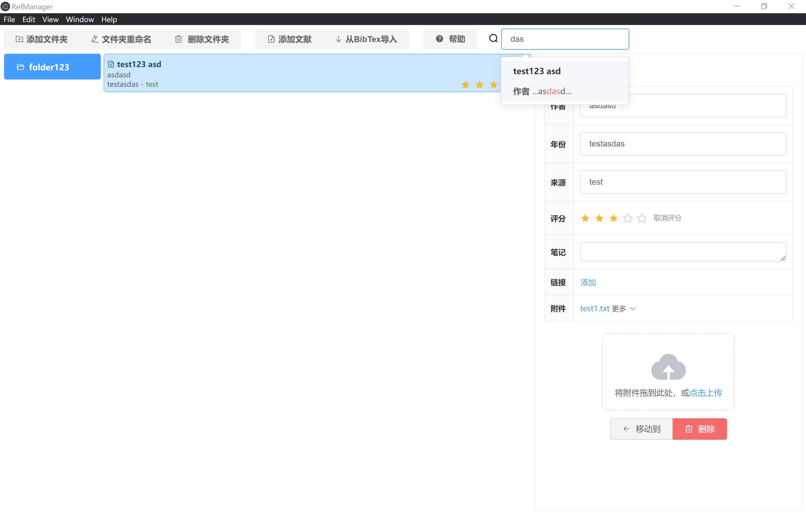

# RefManagerApp

- 会使用端口4331，确保不被占用
- 添加的文献将被复制到`/ExpressApp/documents`中，将整个应用复制到Onedrive里则可以同步

### 1. 下载[exe发行版](https://github.com/guojj33/RefManagerApp/releases/tag/v0.1.0-alpha)直接运行



### 2. 从源码运行、打包

  #### 运行

  ```
  进入ExpressApp路径下执行 npm install
  下载 node-v16.15.0-win-x64 置于 /ExpressApp/ 下

  回到根路径下执行npm install

  执行 npm start
  ```

  #### electron-packager 打包

  ```
  在根路径下执行
  npm install --save-dev electron-packager
  npx electron-packager . --overwrite
  ```
  [更多打包指令](https://github.com/electron/electron-packager/blob/main/usage.txt)
